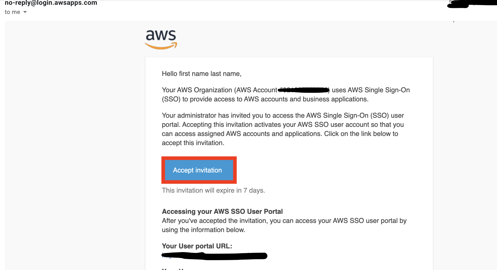
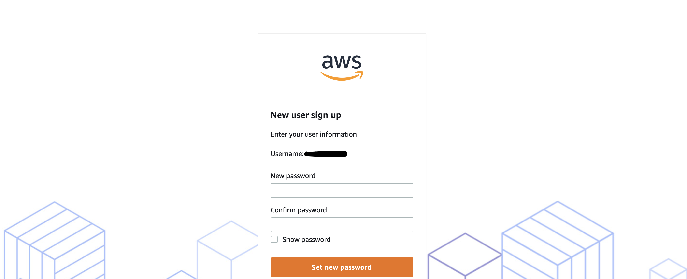
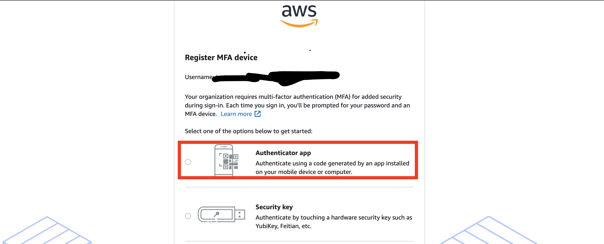
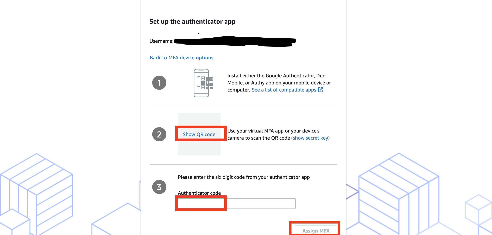
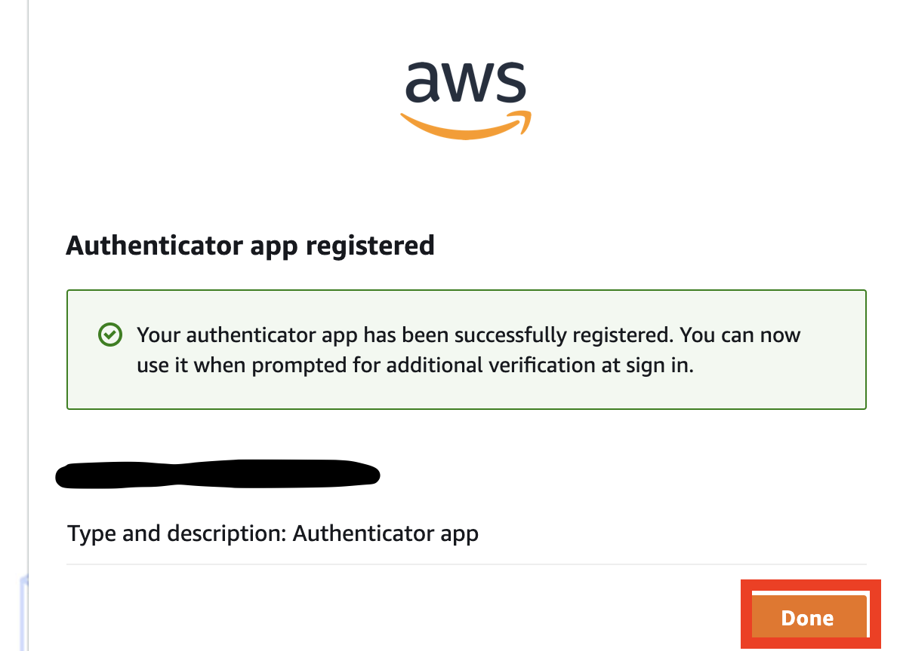
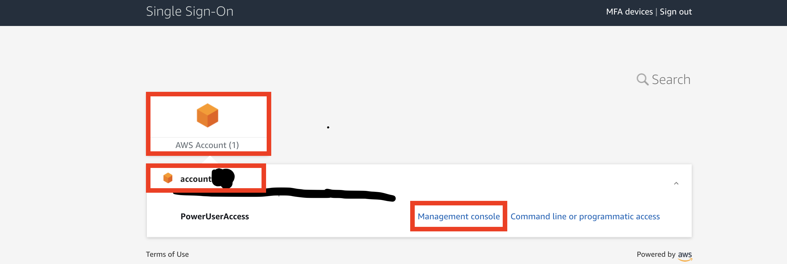
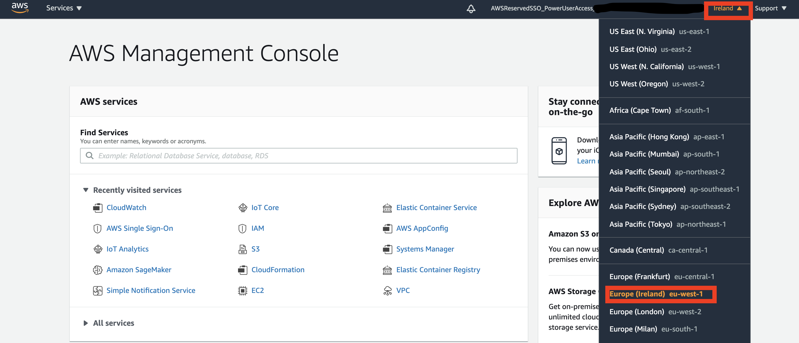
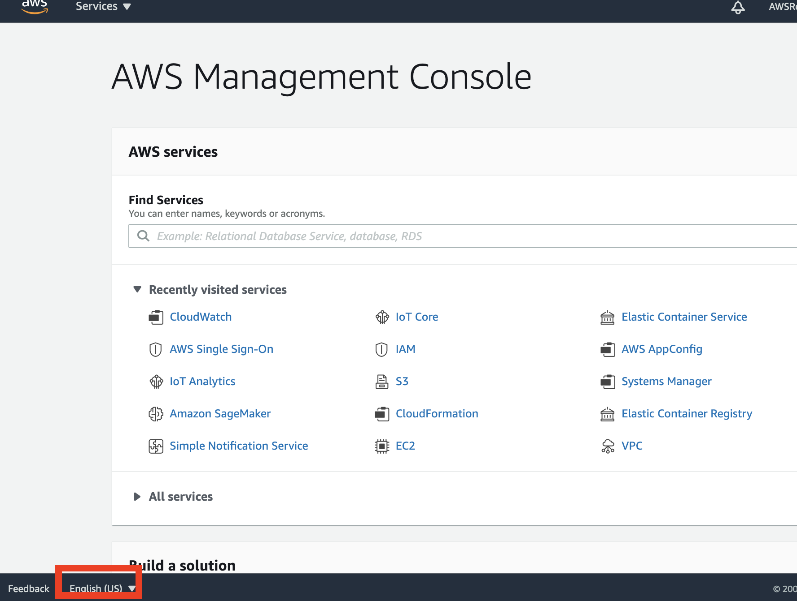

# Session 0
How to authenticate with AWS SSO to AWS Console?

## Change password

1. You should have received an email with title `Invitation to join AWS Single Sign-On` from `no-reply@login.awsapps.com` Click on `Accept invitation`

1. __Set new password__

1. __Sign in__ with your new password

## Set up MFA
1. Select __Authenticator app__

1. Install a Multi-factor authentication (MFA) application on you smartphone, For example, `Google Authenticator` 

1. __Show QR code__, scan with your authenticator app and enter 6 digit __Authenticator code__ then __Assgign MFA__

1. __Sign in__ with your User portal URL (`https://xxx.awsapps.com/start`) with your password and MFA

## Use AWS Console

1. Select `account<your group ID>`

1. You are now using AS Console of your account, select `Ireland` as region

1. Select `English(US)` as language of AWS Console
