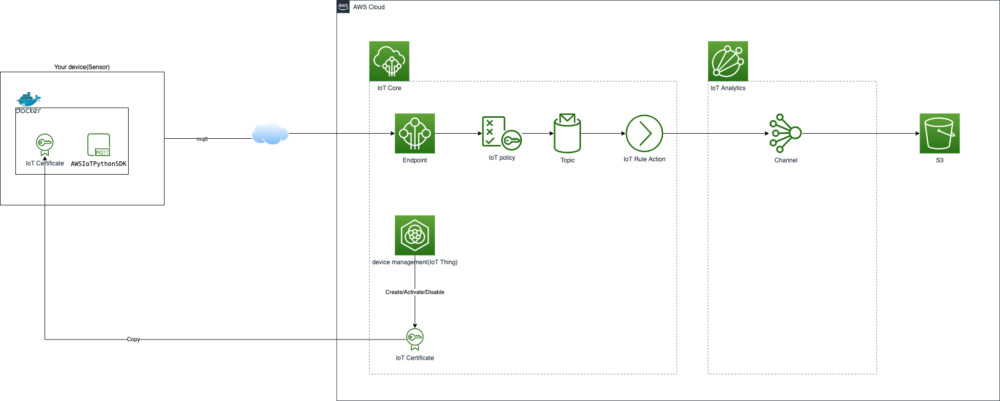
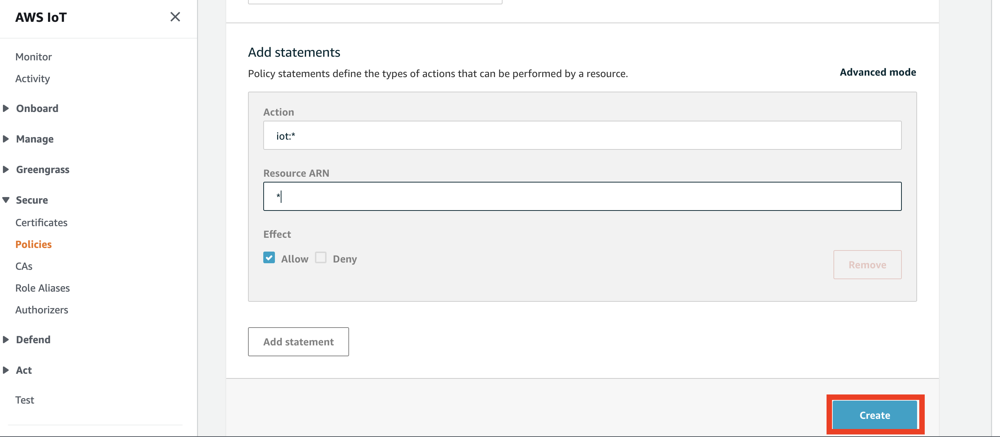
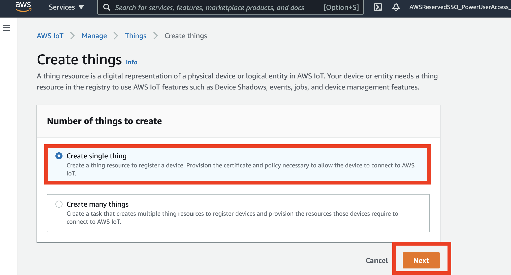
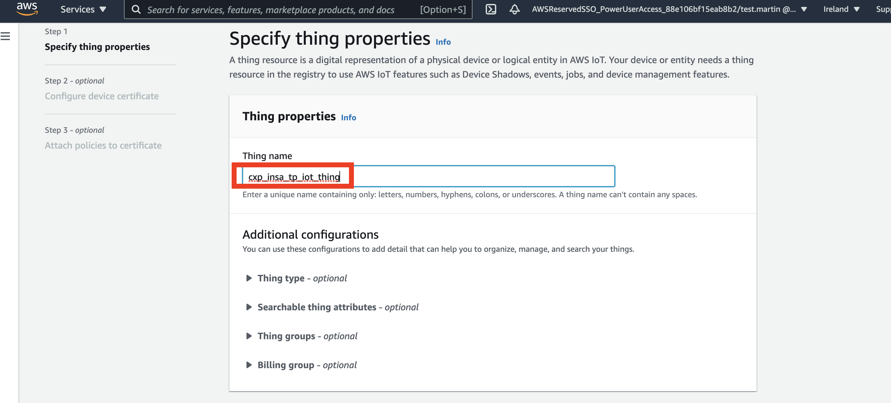
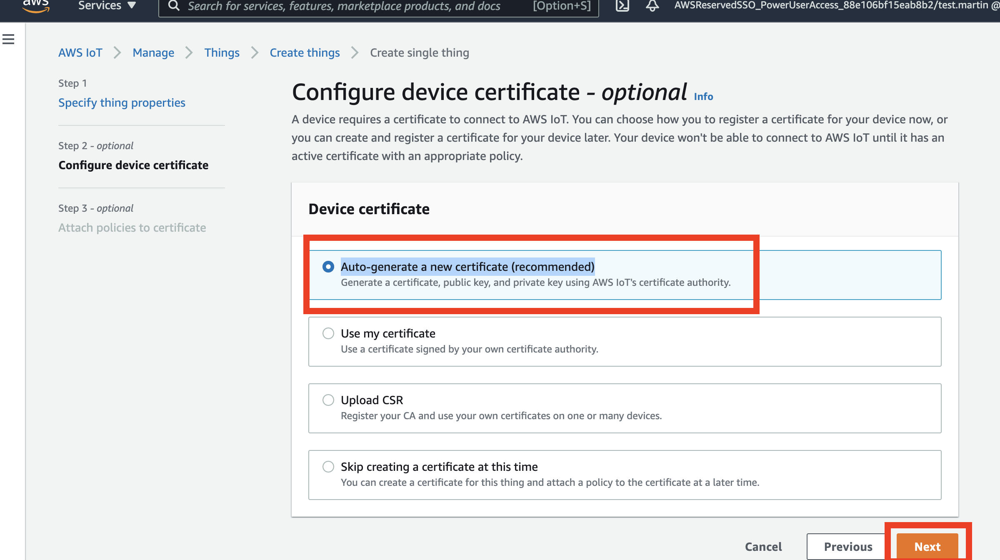
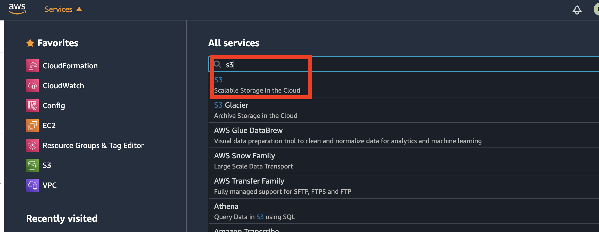
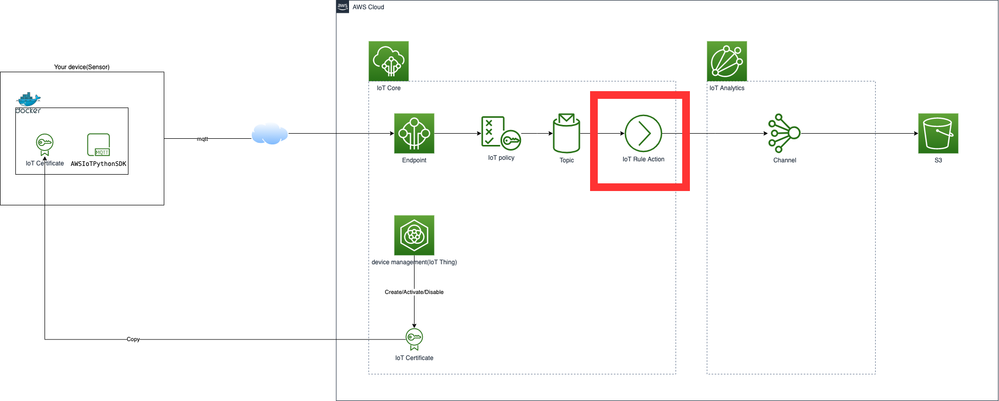

# Session 1
How to publish MQTT messages to AWS IoT Core/Analytics from my device ?

## Architecture

In this training session, we will build following architecture:


## AWS IoT Core
### Create an AWS IoT Core policy
In this section, we will create a IoT Policy:


AWS IoT Core policies allow you to control access to the AWS IoT Core data plane. The AWS IoT Core data plane consists of operations that allow you to connect to the AWS IoT Core message broker, send and receive MQTT messages, and get or update a device's shadow.

1. Open the AWS IoT Core console.


1. In the left navigation pane, choose Secure.


1. Under Secure, choose Policies.


1. Choose Create to create a new policy.

1. On the Create a policy page, enter a Name for your policy. For example, cxp_insa_tp_iot_secure_policy.


1. Under Add statements, do the following:
For Action, enter `iot:*`.
For Resource ARN, enter `*`.
For Effect, select the Allow check box.
__*Note*__: *Allowing all AWS IoT actions (`iot:*`) is useful for testing. However, it's a best practice to increase security for a production setup. For more secure policy examples, see Example AWS IoT policies.*


1. Choose Create.


AWS official documentation: 
* [What is AWS IoT?](https://docs.aws.amazon.com/iot/latest/developerguide/what-is-aws-iot.html) 
* [AWS IoT Core policies](https://docs.aws.amazon.com/iot/latest/developerguide/iot-policies.html)


### Create an AWS IoT thing
In this section, we will create a IoT Thing:


AWS IoT provides a registry that helps you manage things. A thing is a representation of a specific device or logical entity. It can be a physical device or sensor (for example, a light bulb or a switch on a wall). It can also be a logical entity like an instance of an application or physical entity that does not connect to AWS IoT but is related to other devices that do (for example, a car that has engine sensors or a control panel).

__*Note*__: *You don't need to create a thing to connect to AWS IoT. However, things allow you to use additional security controls, as well as other AWS IoT features such as Fleet Indexing, Jobs, or Device Shadow.*

1. In the AWS IoT Core console, in the left navigation pane, choose Manage.


1. Choose Register a thing.


1. On the Creating AWS IoT things page, choose Create a single thing.


1. On the Add your device to the thing registry page, do the following:
Enter a Name for your thing. For example, `cxp_insa_tp_iot_thing`.


1. On the Add a certificate for your thing page, choose Create certificate. You see notifications confirming that your thing and a certificate for your thing are created.


1. On the Certificate created page, do the following:
Under In order to connect a device, you need to download the following, choose Download for the certificate, and private key.


Save each of the downloaded files to `certificates` folder of this repo.

Under You also need to download a root CA for AWS IoT, choose Download. The Server authentication page opens to CA certificates for server authentication.


1. Under Amazon Trust Services Endpoints (preferred), choose Amazon Root CA 1. The certificate opens in your browser.


1. Copy the certificate (everything from -----BEGIN CERTIFICATE----- to -----END CERTIFICATE-----) and paste it into a text editor.

1. Save the certificate as `AmazonRootCA1.pem` to `certificates` folder of this repo..

1. On the Certificate created page in the AWS IoT Core console, choose Activate. The button changes to Deactivate.

1. Choose Attach a policy.


1. On the Add a policy for your thing page, do the following:
Select the AWS IoT Core policy that you previously created. For example, admin.
Choose Register Thing.


### Copy the AWS IoT Core endpoint URL
In this section:


1. In the AWS IoT Core console, in the left navigation pane, choose Settings.


1. On the Settings page, under Custom endpoint, copy the Endpoint. This AWS IoT Core custom endpoint URL is personal to your AWS account and Region.


## AWS IoT Analytics
### Create a S3 bucket for AWS IoT Analytics channel
In this section:


1. Open the S3 console.


1. Create a bucket.


1. Enter a Name for your bucket. For example, `cxp-insa-tp-iot-analytics-channels-<your group id>`.
__Note__: __*An Amazon S3 bucket name is globally unique, and the namespace is shared by all AWS accounts. This means that after a bucket is created, the name of that bucket cannot be used by another AWS account in any AWS Region until the bucket is deleted.*__

1. Choose `eu-west-1` as Region and Check `Block all public access` option:


1. Keep default options and Create bucket:


### Create an AWS IoT Analytics channel
In this section:


1. Open the AWS IoT Analytics console.


1. Choose Create channnel.


1. Enter a Name for your channel. For example, `cxp_insa_tp_iot_channel` and Choose `Customer-managed S3 bucket`.


1. Choose your S3 bucket `cxp_insa_tp_iot_channel` and Choose `cxp-insa-tp-iot-datastore-role` then Next.


1. Create Channel.


### Create an AWS IoT Core Rule
In this section:


1. Open the AWS IoT Core console.


1. Act -> Rules -> Create a Rule.


1. Enter a Name,  For example, `cxp_insa_tp_iot_channel`, and Choose `2016-03-23` as Using SQL version and Enter `SELECT * FROM 'cxp_insa_tp_iot_mqtt_topic'` as Rule query statement


1. In Set one or more actions, Choose Add action


1. Select __Send a message to IoT Analytics__, then __Configure action__,


1. Select __Manually select IoT Analytics Channel and role__, use `cxp_insa_tp_iot_channel` as Channel name and `cxp_insa_tp_iot_rule_access_role`as Role, then __Add action__


1. __Create rule__,


## publish MQTT messages from my device
In this section, we will configure our mqtt client with docker:


### Update configuration MQTT Client

1. Update and adjust theses configurations of `mqtt_client_json_publisher.py` in this folder:
```python
# Configuration
# Define ENDPOINT, CLIENT_ID, PATH_TO_CERT, PATH_TO_KEY, PATH_TO_ROOT, MESSAGE, TOPIC, and RANGE
ENDPOINT = "xxxxxxxxxxxxxx-ats.iot.eu-west-1.amazonaws.com"
PATH_TO_CERT = "certificates/xxxxxxxxxx-certificate.pem.crt"
PATH_TO_KEY = "certificates/xxxxxxxxxx-private.pem.key"
PATH_TO_ROOT = "certificates/AmazonRootCA1.pem"
TOPIC = "cxp_insa_tp_iot_mqtt_topic"
CLIENT_ID = "cxp_insa_tp_iot_client_id"
PORT = 8883
```

### Build a docker image
```bash
docker build -t cxp-insa-tp-iot-mqtt-client .
```

# TODO How to deploy and run in rasberrypi device farm?

### publish MQTT messages with docker container
```bash
docker run cxp-insa-tp-iot-mqtt-client
```

The Python program publishes 1000 messages/s to the topic `cxp_insa_tp_iot_mqtt_topic` that you created in the AWS IoT Core console. View the topic in the console to see the published messages.