# Session 2
How to extract temperature information in real time?

## Architecture

In this training session, we will add IoT Analytics Pipeline and IoT Analytics Datastore to our existing architecture:
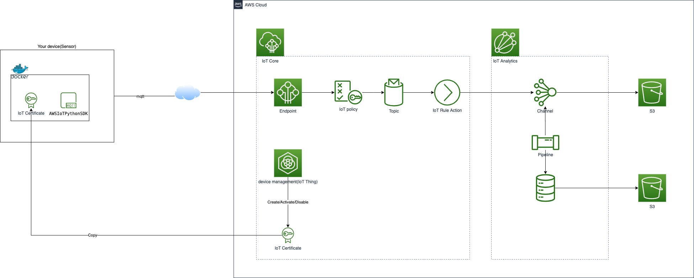

## Data

We are using data from SYNOP, for more information about SYNOP: [https://public.opendatasoft.com/explore/dataset/donnees-synop-essentielles-omm/information/?sort=date](https://public.opendatasoft.com/explore/dataset/donnees-synop-essentielles-omm/information/?sort=date)

In preview session, we have published to AWS IoT data of 2016-2019. In this session, we will extract only temperature and date.

## IoT Analytics Datastore

In this section, we will create a IoT Analytics Datastore:
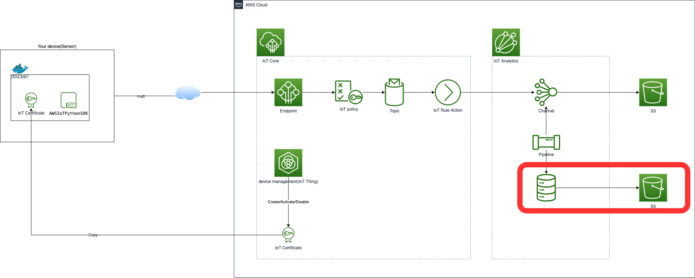

### Create a dedicated S3 bucket for AWS IoT Analytics datastore
1. Open the S3 console.


1. Create a bucket.
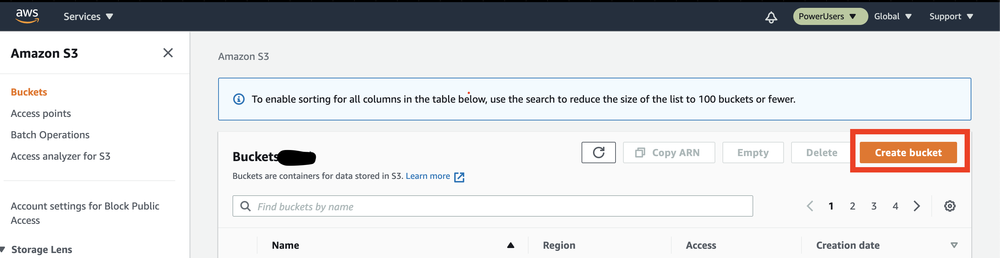

1. Enter a Name for your bucket. For example, `cxp-insa-tp-iot-analytics-datastore-<your group id>`.
__Note__: __*An Amazon S3 bucket name is globally unique, and the namespace is shared by all AWS accounts. This means that after a bucket is created, the name of that bucket cannot be used by another AWS account in any AWS Region until the bucket is deleted.*__

1. Choose `eu-west-1` as Region and Check `Block all public access` option
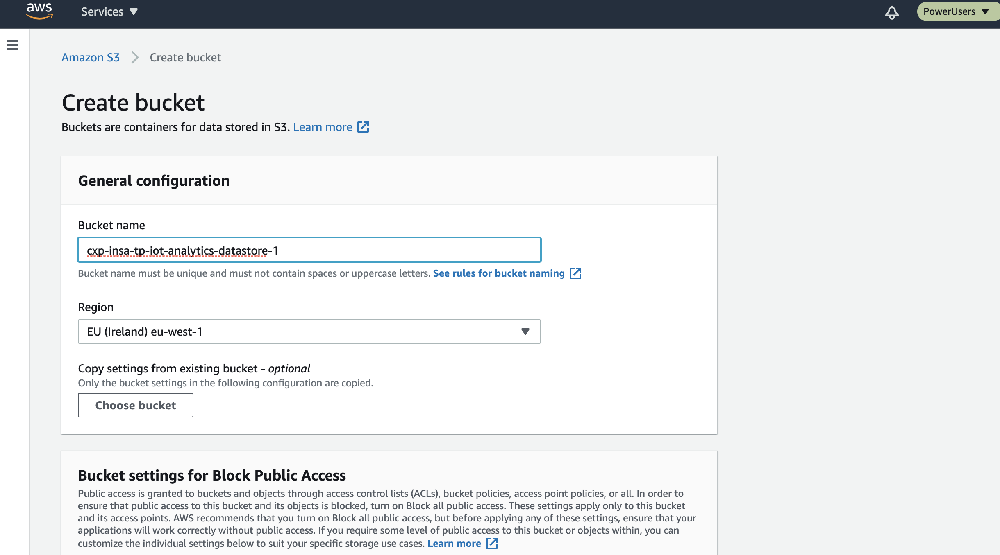

1. Keep default options and Create bucket:
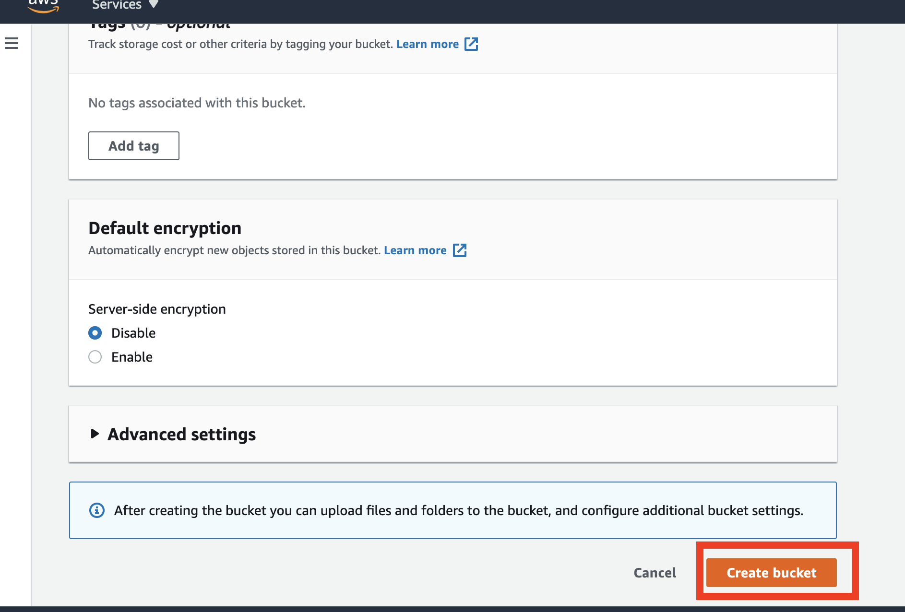

1. Once created, go to the bucket `cxp-insa-tp-iot-analytics-datastore-<your group id>`. In "Permissions", edit "Bucket policy" and enter the following configuration and "save changes":
```json
{
    "Version": "2012-10-17",
    "Statement": [
        {
            "Effect": "Allow",
            "Principal": {
                    "Service": "iotanalytics.amazonaws.com"
                },
            "Action": [
                    "s3:GetBucketLocation",
                    "s3:GetObject",
                    "s3:ListBucket",
                    "s3:ListBucketMultipartUploads",
                    "s3:ListMultipartUploadParts",
                    "s3:AbortMultipartUpload",
                    "s3:PutObject",
                    "s3:DeleteObject"
                ],
            "Resource": [
                    "arn:aws:s3:::cxp-insa-tp-iot-analytics-datastore-<your group id>",
                    "arn:aws:s3:::cxp-insa-tp-iot-analytics-datastore-<your group id>/*"
                ]
        }
    ]
}

```

### Create an AWS IoT Analytics Datastore
1. Open the AWS IoT Analytics console.


1. Choose Create a datastore.
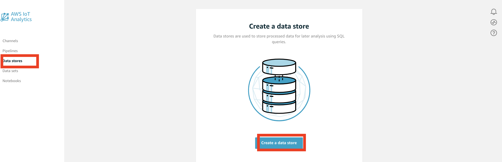

1. Enter a Name for your channel. For example, `cxp_insa_tp_iot_datastore` and Choose `Customer-managed S3 bucket` and select `cxp-insa-tp-iot-analytics-datastore-<your group id>` and select IAM Role `cxp-insa-tp-iot-datastore-role`.
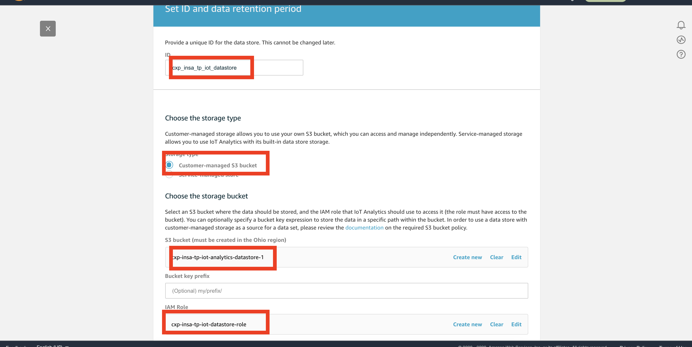

1. Create datastore.

## IoT Analytics Pipeline

In this section, we will create a IoT Analytics Pipeline:
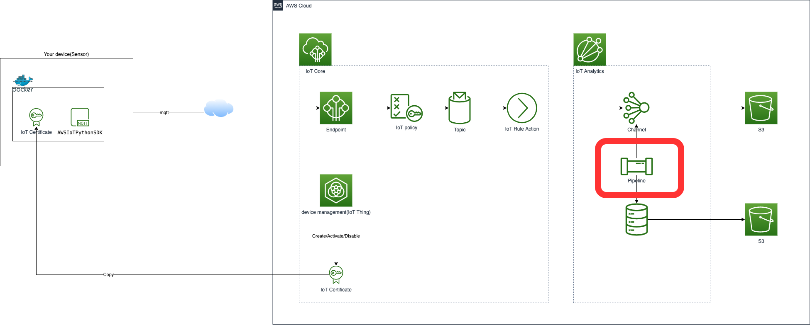

An AWS IoT Analytics Pipeline consumes messages from one or more Channels. Pipelines transform, filter, and enrich the messages before storing them in IoT Analytics Data stores. A Pipeline is composed of an array of activities. Logically, you must specify both a Channel (source) and a Datastore (destination) activity. Optionally, you may choose as many as 23 additional activities in the pipelineActivities array.

1. Open the AWS IoT Analytics console.


1. Create a pipeline.
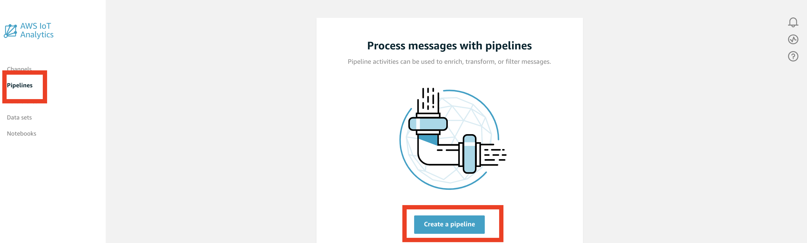

1. Enter a Name for your pipeline. For example, `cxp_insa_tp_iot_pipeline` and Choose `cxp_insa_tp_iot_channel` as pipeline source
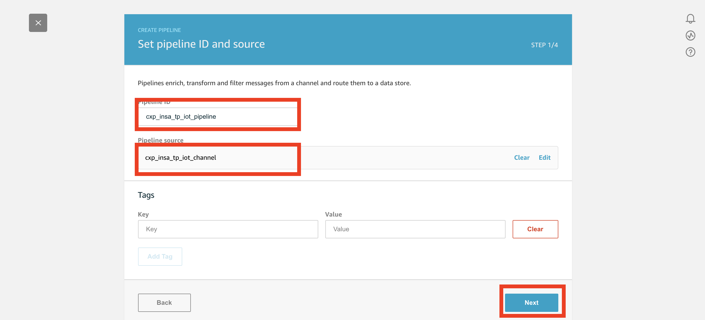

1. You can see all attributes of MQTT message, Click on __Next__
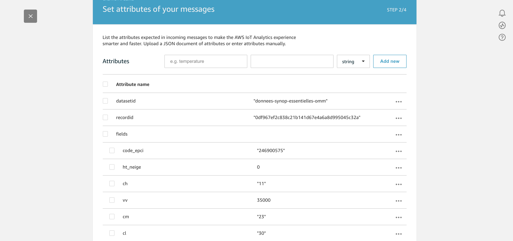

1. Add __transform__ activity
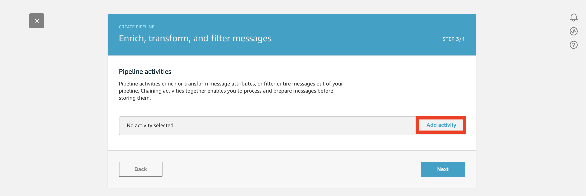

1. Let's calculate a message attribute
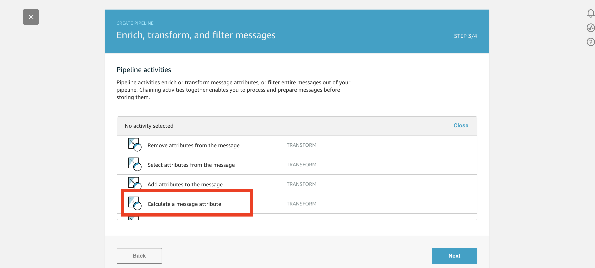

1. Add a new attribute `TemperatureC` with Formula `fields.t - 273.15`
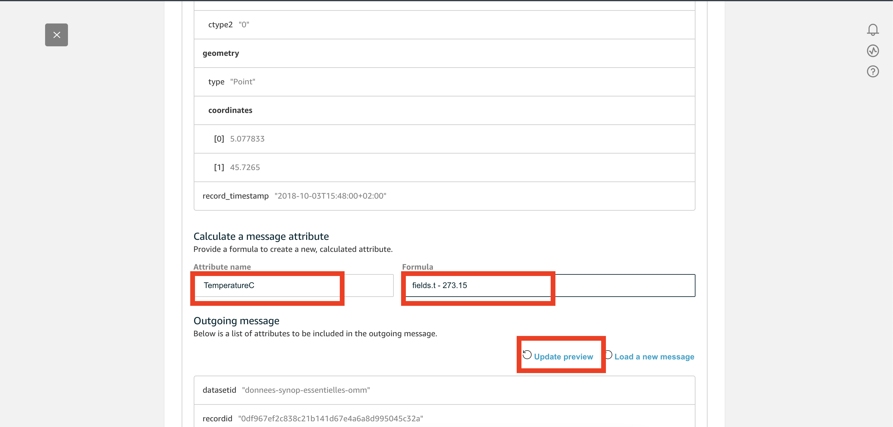

1. With __Update preview__, you will be able to see `TemperatureC` in __Ougoing Message__
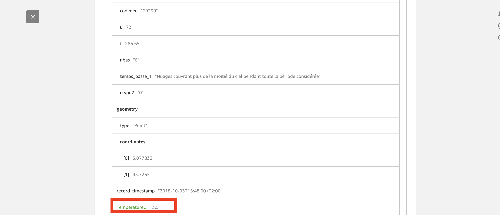

1. Add other __transform__ activity
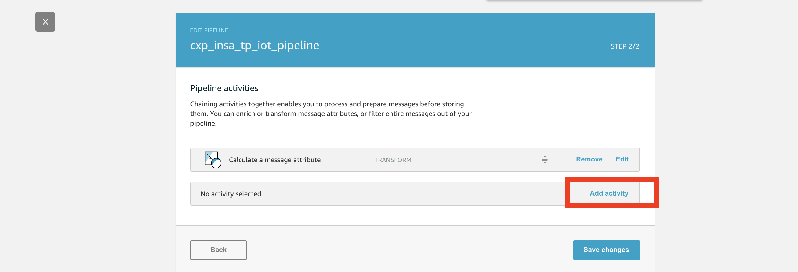

1. Select __Select attributes from the message__
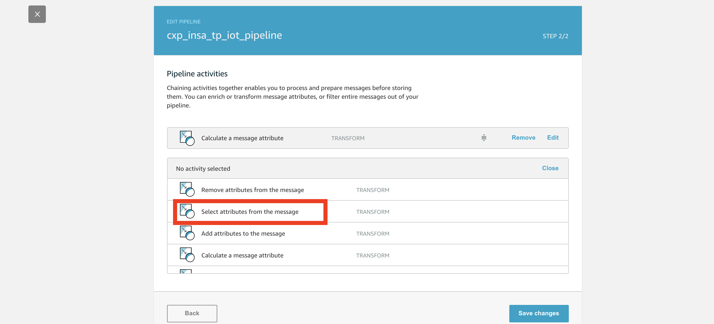

1. In __Select message attributes__ section
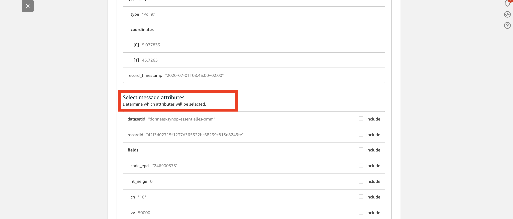

1. Include `fields.date` `fields.t` and `TemperatureC`
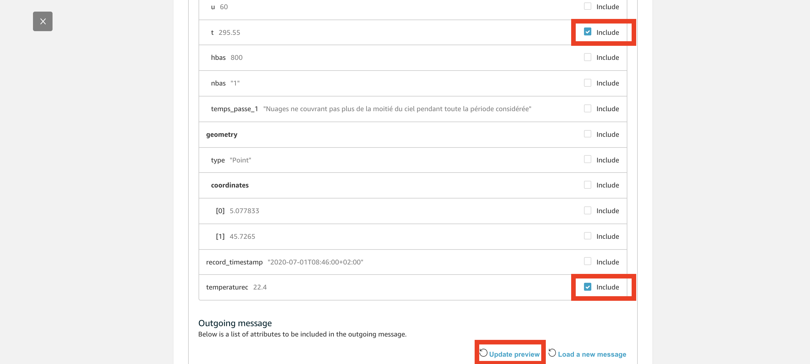

1. With __Update preview__, you will be able to see `date` `TemperatureC` `t` in __Ougoing Message__, then __Save Changes__
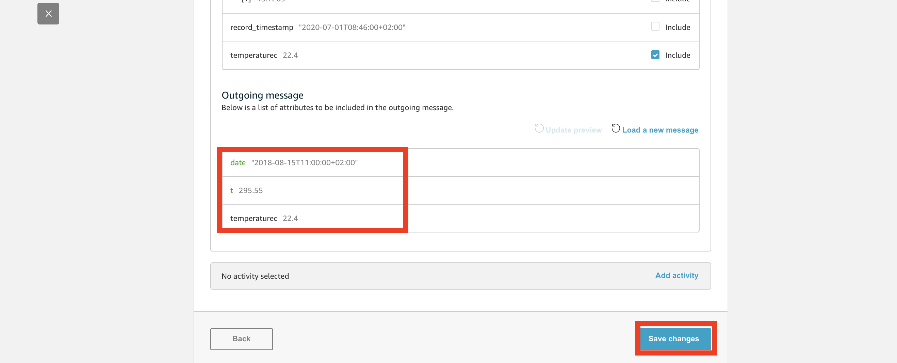

1. Select `cxp_insa_tp_iot_datastore` as __Pipeline output__ and __Create pipeline__
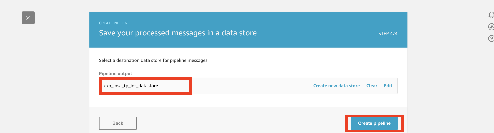

1. After pipeline creation, Select `cxp_insa_tp_iot_pipeline`
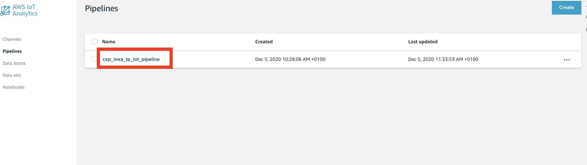

1. After pipeline creation, Select `cxp_insa_tp_iot_pipeline`


1. __Reprocess messages__
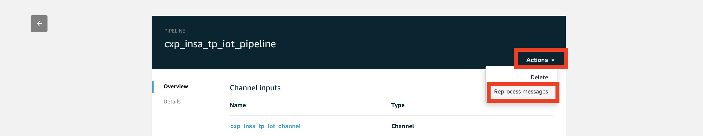

1. __Start reproccessing__
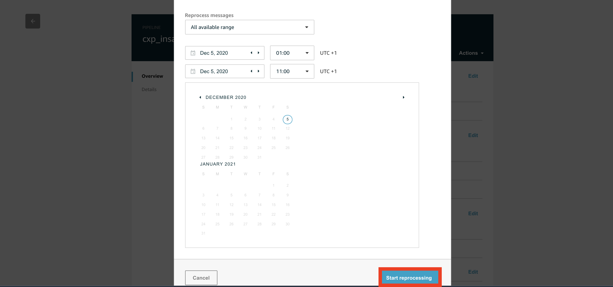

1. Wait until reprocessing completed
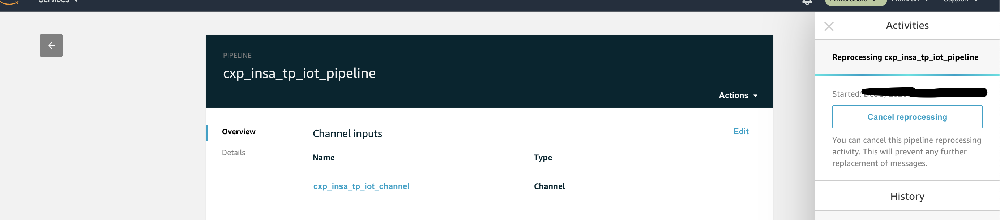