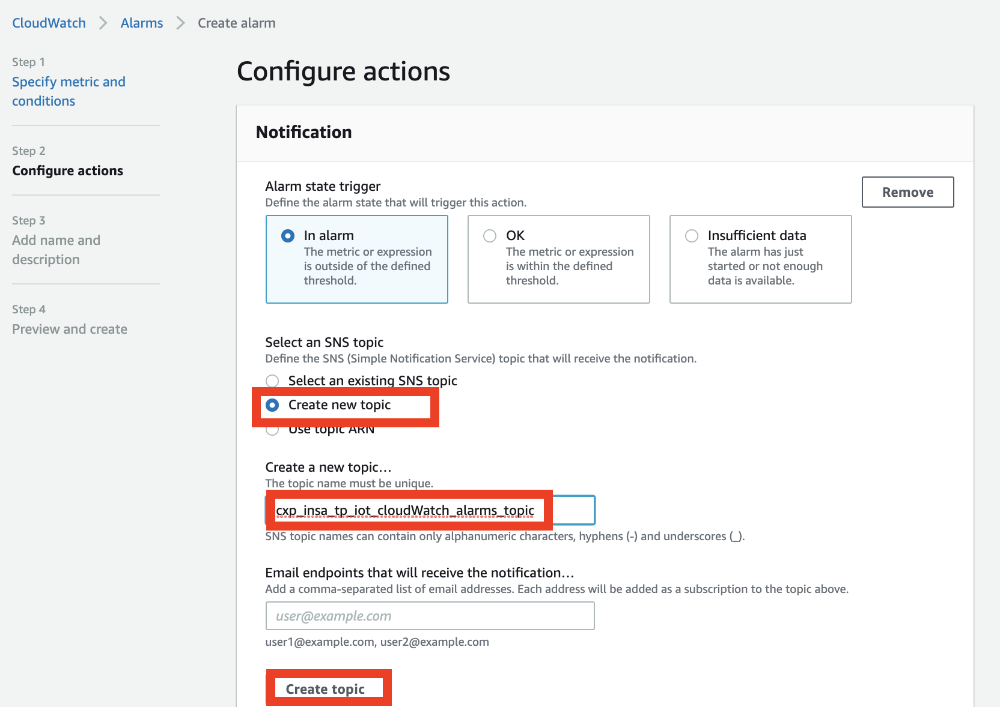

# Session 4
How to monitor my service and receive alert if something goes wrong?

## Architecture

In this training session, we will use CloudWatch to monitor the number of mqtt messages published and use CloudWatch Alarm to detect if number of mqtt messages published is too high, and SNS to be notified by text message:

## CloudWatch
In this section, we will use CloudWatch:

CloudWatch is a monitoring and observability service built for DevOps engineers, developers, site reliability engineers (SREs), and IT managers. CloudWatch provides you with data and actionable insights to monitor your applications, respond to system-wide performance changes, optimize resource utilization, and get a unified view of operational health

### Use CloudWatch to monitor MQTT published messages

1. Open the CloudWatch console.

1. Select __Metrics__ and __IoT__.

1. Select __Protocol Metrics__.

1. Select __PublishIn.Success__.

1. Use __Sum__ as __static__.

1. Use __1 minute__ as __Period__.

1. You can see number of mqtt messages per minute.

### Set up CloudWatch Alarm to detect if number of mqtt messages per minute is too high

1. Open the CloudWatch console.

1. Select __Alarms__

1. __Create alarm__

1. __Select metric__

1. __IoT__

1. __Protocol Metrics__ > __PublishIn.Success__.

1. __Static__:`Sum` __Period__:`1 minute`.

1. Parameter threshold.

1. Create a SNS topic with your email.

1. Add alarm name. For example, `cxp_insa_tp_iot_mqtt_messages_too_many`

1. Create alarm.

## SNS
In this section, we will use SNS to send notification:

Amazon Simple Notification Service (Amazon SNS) is a fully managed messaging service for both application-to-application (A2A) and application-to-person (A2P) communication

### SNS topic subscription

1. Open the SNS console.

1. Click on SNS topic created in cloudwatch alarm section.

1. __Create subscription__

1. __Protocol__: `SMS`

1. Enter your phone number and __Create subscription__

### Trigger an alarm

Re publish all mqtt messages of session 1 to verify if you receive a sms notification

[session 1](../1_publish_mqtt/README.md)