# Session 5
How to use IoT Analytics Dataset to train a machine learning model?

## Architecture

In this training session, we will create a notebook instance to train a machine learning model with existing dataset in IoT analytics:
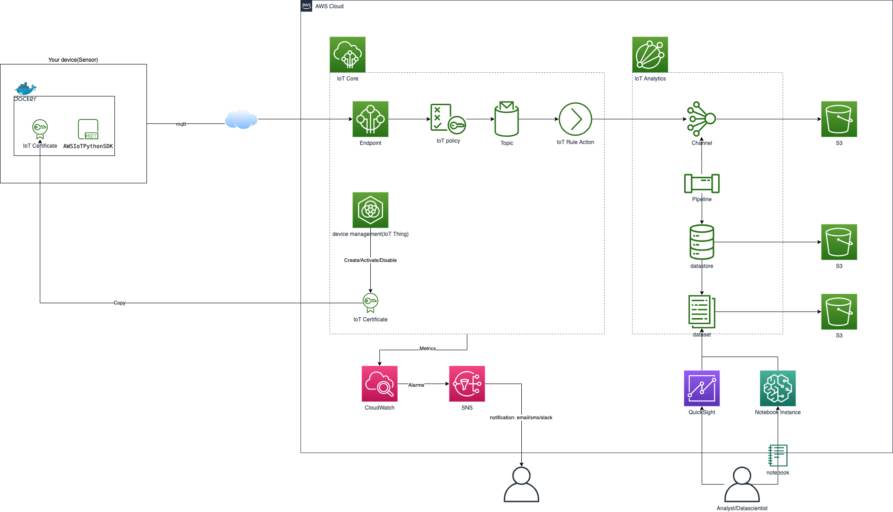

## Notebooks
In this section, we will create a Notebook instance (SageMaker) to train a machine learning model with existing dataset in IoT analytics :
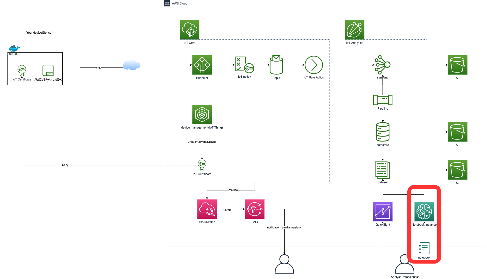

### Create a Notebook instancce

1. Open the AWS IoT Analytics console.
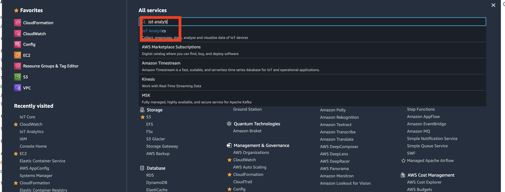

1. __Create Notebook__
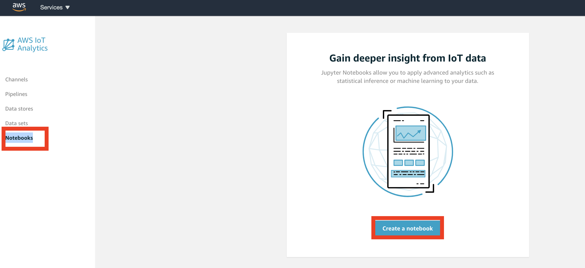

1. __Blank Notebook__
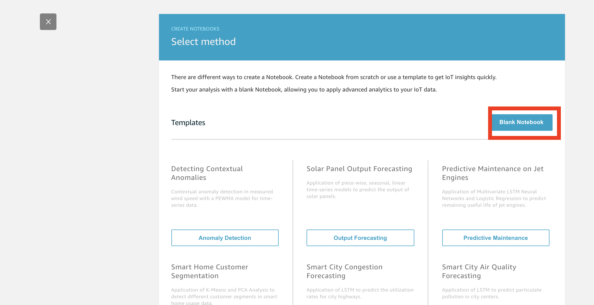

1. Enter a Name for your notebook. For example, `cxp_insa_tp_iot_notebook` select `cxp_insa_tp_iot_dataset` as __dataset source__ then __Create new__ notebook instance.
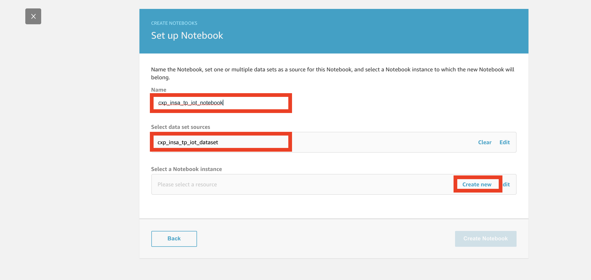

1. Enter a Name for your notebook instance. For example, `cxp-insa-tp-iot-notebook-instance` select `ml.m4.xlarge` as __Instance type__ then select `cxp-insa-tp-iot-notebook-role` as role.
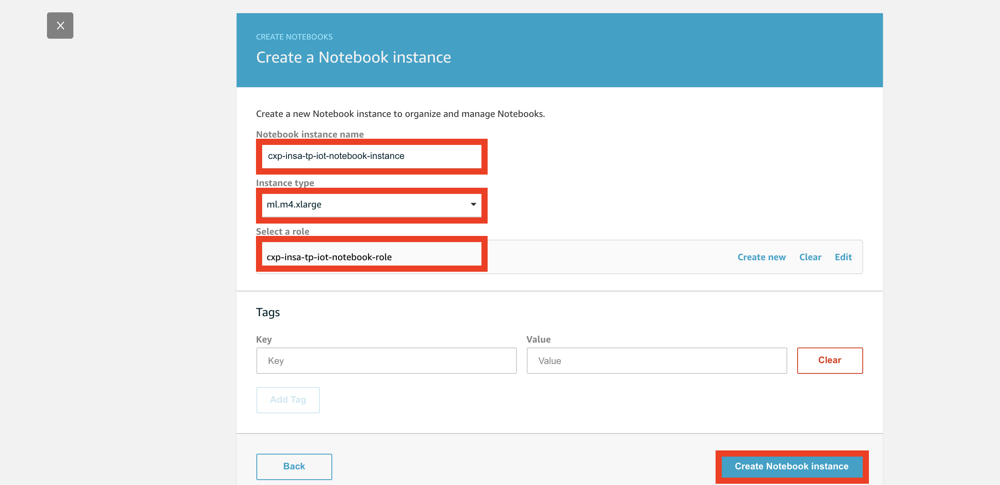

1. Notebook instance will be `Pending` during about 5-10 minutes.
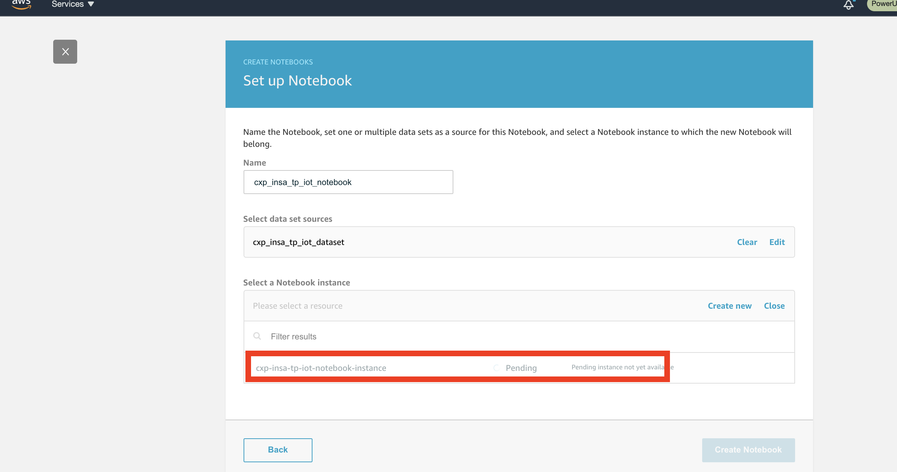

1. Select notebook instance `cxp-insa-tp-iot-notebook-instance`.
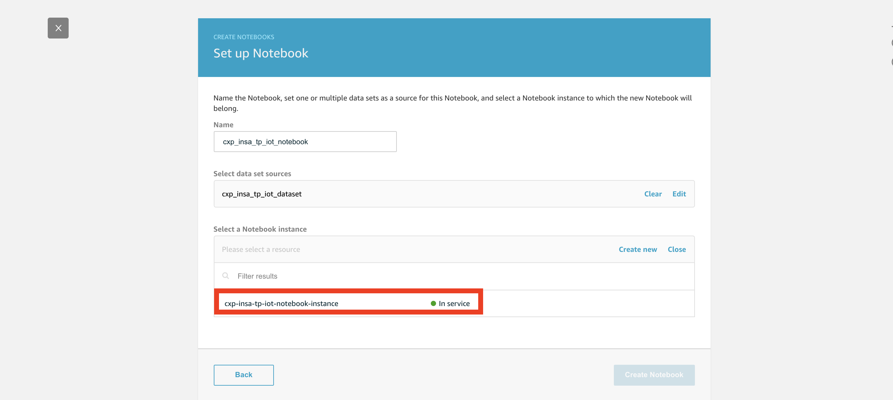

1. __Create Notebok__.
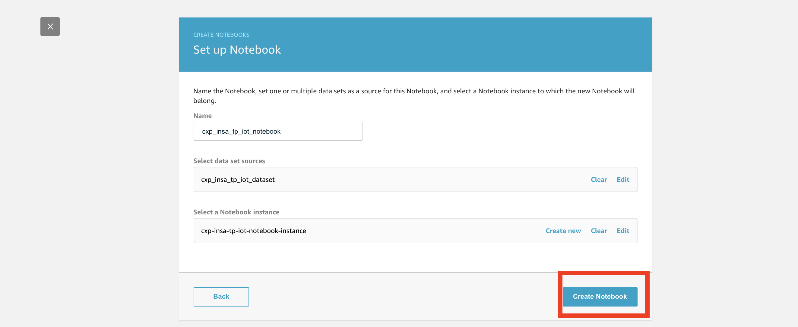

### Upload .ipynb file

1. __Open in Jupyter__.
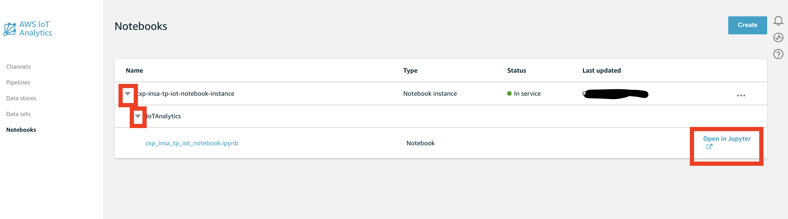

1. __Shutdown__ generated notebook.
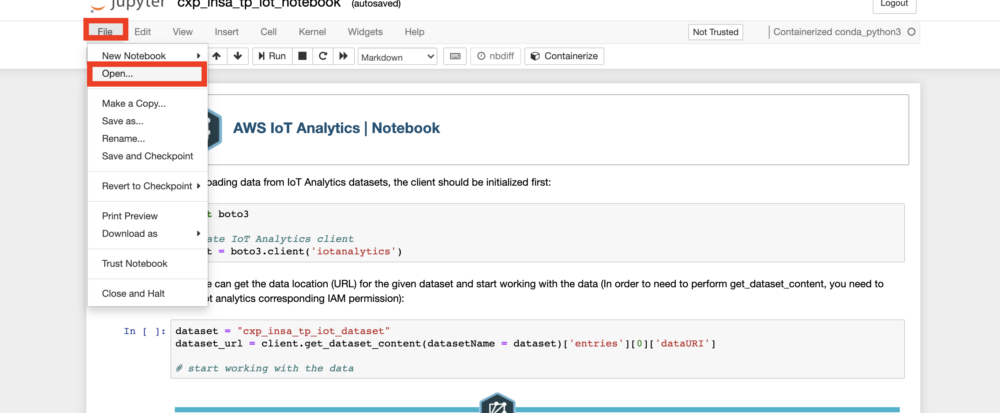
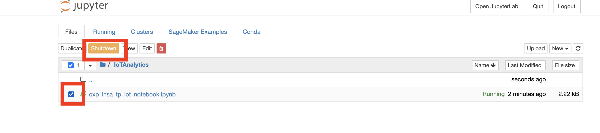

1. Upload .ipynb file.
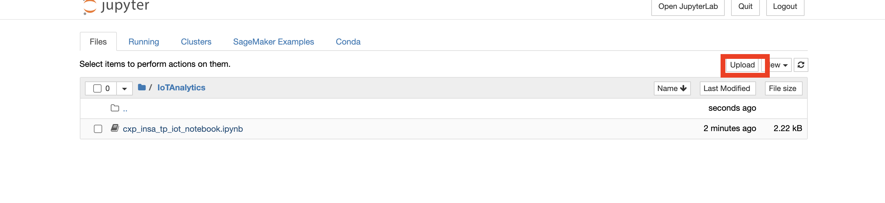